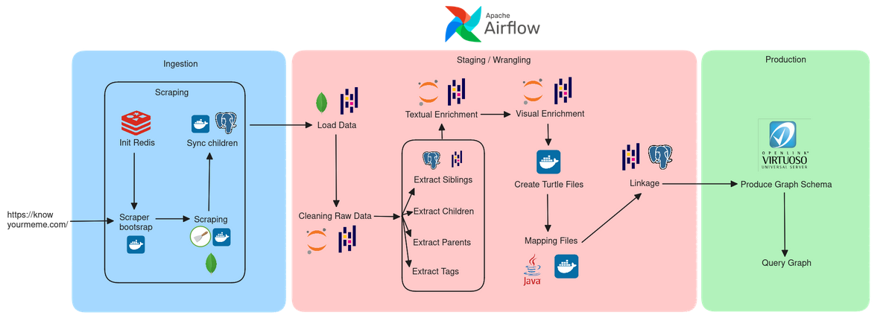

# Data Engineering Project: Memes

Welcome to the Memes Data Engineering Project! This repository is dedicated to the pipeline that ingests, cleanses, transforms, and enhances raw meme data from Know Your Meme, Imgflip and Wikidata.

## Table of Contents

1. [Introduction](#introduction)
2. [Ingesting](#ingesting)
3. [Cleansing](#cleansing)
4. [Transforming](#transforming)
5. [Enhancing](#enhancing)
6. [Getting Started](#getting-started)

## Introduction

Questions formulated for analyzing the meme dataset:

1. **Top 3 movies which generated the most memes**: Find out which movies have produced the most memes in our dataset.

2. **Is there more animals than humans used in memes?**: Discover whether animals are more prevalent than humans in memes.

## Pipeline



## Ingesting

In the initial phase of our data engineering project, we set up a pipeline to bring raw meme data into our landing zone, which is a MongoDB database. To do this, we created two scraper to collect data from KnowYourMeme and Imgflip.

The `KYM_Scraper` and `Imgflip_Scraper` are `scrapy` projects that scrapes the Know Your Meme and Imgflip websites for memes and their associated data.
The scrapper use a `Redis` database to store the URLs to be scraped and store the scraped data in a `MongoDB` database.
Relationships between memes (e.g. parent-child) are stored in a `PostgreSQL` database before updating the `MongoDB` documents.

Here is the link to the tools : 
https://github.com/meme-schievous/kym-scrapper
https://github.com/meme-schievous/imgflip-scraper

## Cleansing

In this stage, we're currently working on the cleansing process to ensure the data is of high quality. Check back here soon for more updates!

## Transforming

Stay tuned! We're actively developing the data transformation process to prepare the meme data for further analysis. 

## Enhancing

We're also planning enhancements for the dataset, making it more robust and insightful. Updates will be provided soon.

## Enhancing

We're also planning enhancements for the dataset, making it more robust and insightful. Updates will be provided soon.

## Getting Started

If you'd like to run the code for this project, follow these steps:

1. Make sure you have Docker installed.

2. Run the following commands:

   ```bash
   mkdir -p ./dags ./logs ./plugins ./config
   echo -e "AIRFLOW_UID=$(id -u)" > .env
   docker compose build
   docker compose up airflow-init
   docker compose -f docker-compose.yaml up
   ```

